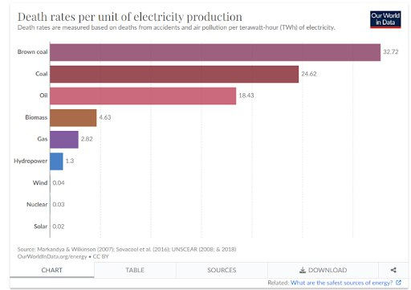

+++
title = 'Критическая масса. АЭС в Казахстане'
keywords = ["Казахстан", "Энергетика", "Электростанция", "Энергодефицит", "Износ электроэнергии", "Региональные электросетевые компании (РЭК)", "Тарифы на электроэнергию", "Атомная электростанция", "Классовая борьба", "Империализм", "Монополия", "Капитализм", "Экономические интересы", "Рабочий класс", "Народное благо", "Модернизация инфраструктуры", "Электросети", "Социальная справедливость", "Инфляция", "Эксплуатация"]
description = """В конце лета 2023 г. в селе Улькен Алматинской области, где планируется строительство АЭС, проводилось публичное обсуждение этого проекта, а 6 октября 2024 г. официально проводился референдум о строительстве. В первом мероприятии участвовали местные жители, журналисты, представители общественного совета области, Минэнерго Казахстана, администрации Алматинской области, Национального ядерного центра, а также Института ядерной физики и ТОО «Казахстанские атомные электрические станции». Можно считать, что это очередной шаг в направлении строительства АЭС в стране, обсуждение которого затянулось почти на 20 лет. Необходимо отметить, что сейчас вопрос поднимается всё чаще. Разберём причины этого процесса, куда может привести строительство АЭС и что ждать простому трудящемуся?"""
category = ['Статья']
date = 2024-10-17 16:01:04
featured_image = 'IMG_1105.JPG'
+++

## 1 АЭС в Казахстане: шаг к энергетической независимости или угроза для простых граждан?

В конце лета 2023 г. в селе Улькен Алматинской области, где планируется строительство АЭС, проводилось публичное обсуждение этого проекта, а 6 октября 2024 г. официально проводился референдум о строительстве. В первом мероприятии участвовали местные жители, журналисты, представители общественного совета области, Минэнерго Казахстана, администрации Алматинской области, Национального ядерного центра, а также Института ядерной физики и ТОО «Казахстанские атомные электрические станции». Можно считать, что это очередной шаг в направлении строительства АЭС в стране, обсуждение которого затянулось почти на 20 лет. Необходимо отметить, что сейчас вопрос поднимается всё чаще. Разберём причины этого процесса, куда может привести строительство АЭС и что ждать простому трудящемуся?

## 2.1. Как работает атомная энергия: ликбез о принципах, мифах и реальности ядерной энергетики

Для корректного освещения проблемы необходимо привести хотя бы общие сведения о принципах работы атомной энергетики, т.к., помимо низкой осведомленности, для этой темы характерны небеспочвенные предрассудки и дезинформация. Эта часть будет иметь формат ликбеза, разбирающиеся в теме могут её пропустить.

Судя по названию, атомная энергия – энергия, получаемая при взаимодействии атомных ядер. Будет описываться только энергия, получаемая при делении ядер (т.к. слияние промышленно не применяется). Коротко говоря, основная суть заключается в проведении реакции, при которой нестабильное ядро (радиоактивное) некоторого элемента распадается на два ядра, кинетическая энергия движения которых больше чем затраченная изначально на создание первоначального (радиоактивного) ядра. Часто это радиоактивное ядро – уран-236, получаемый при захвате нейтрона ядром урана-235. Распадаясь, уран-236 не только испускает два ядра, но еще и 2-3 нейтрона, что позволяет сделать реакцию цепной – самоподдерживающейся (при наличии урана-235).

Реакция является цепной, когда на каждый последующий акт деления будет приходиться больше (или столько же) делящихся ядер. Отношение количества нейтронов деления в последующем акте к нынешнему называется коэффициентом деления. Цепная реакция становится возможной, когда значение этого коэффициента k≥1 (больше или равно 1). Область пространства реактора, где k=1,  называется критическим размером, а масса делящегося вещества в этой области – критической массой.

|  |
|--|
| Рисунок 1 – Цепная реакция. |

В естественных условиях концентрация урана-235 малая. Уран-238 составляет 99,3% всего элемента урана, на 235 приходится менее 0,7%. Очевидно, что в естественном уране не происходят никакие цепные ядерные реакции и поэтому из урана естественного получают уран обогащенный, т.е. увеличивают концентрацию урана-235, к примеру, на центрифугах. Как правило для нужд электроэнергетики достаточное обогащение – до 20%, в оружейном – около 80-90%. К слову, в процессе обогащения урана останется две доли урана – обогащенная и обеднённая (тут урана-235 до 0,3%). Применение последнего сейчас актуализируется в военных целях.

## 2.2. Атомная электростанция: как работает цепная реакция и что происходит внутри реактора?

Теперь необходимо перейти к конструкции и составным частям энергоблока АЭС [1]. Условно схема АЭС выглядит следующим образом.

|  |
|--|
| Рисунок 2 – Схема АЭС.|

В самом реакторе находится активная зона, где происходит цепная реакция. Там же находятся стержни управления, созданные из материалов, хорошо поглощающих нейтроны, (например, бор) которые появляются при распаде урана-236 в количестве 2-3 штук. Они используются для уменьшения числа нейтронов в активной зоне чтобы контролировать цепную реакцию. Нейтроны, полученные в результате реакции, вылетают из ядра с высокой энергией – слишком высокой, чтобы эффективно поглотиться другим ядром урана. Существует общая закономерность, согласно которой вероятность взаимодействия нейтронов с ядрами убывает обратно их скорости. Поэтому их следует замедлять, например, водой.

Итак, имеем два осколка-ядра после деления урана-236. Эти ядра передают свою кинетическую энергию движения теплоносителю (часто это вода) в активной зоне посредством соударения с его атомами. На рисунке теплоноситель циркулирует в пределах первого контура, который окрашен оранжевым цветом; теплоноситель показан красным штрихом. Теплоноситель нагревается (контур может находится под давлением) и это тепло передаётся в внешний контур без прямого контакта (область, где контур соприкасается с парогенератором). В парогенераторе находится вода, которая после получения тепла переходит в газообразное состояние и направляется к турбине. Турбина вращается и крутит электродвигатель генератора, электрический ток получен.

## 2.3. Безопасность на АЭС: как атомная энергетика стала одной из самых надежных и чистых альтернатив
Однако это ещё не все. Радиация имеет негативное влияние на окружающую среду и человека, поэтому на станциях предусмотрены системы безопасности.

В первую очередь – это контролирующие стержни, о которых сказано ранее. Материал, из которого они сделаны поглощает нейтроны. Уровень погружения поглощающих стержней в активную зону, а также концентрации борной кислоты в охлаждающем контуре автоматически регулируются системой управления и защиты под пристальным контролем команды операторов, которые в зависимости от требуемой мощности реактора могут регулировать цепную реакцию с помощью электрического сигнала с пульта.

Если при чрезвычайной ситуации на станции пропадет электричество, то поглощающие стержни автоматически погрузятся в активную зону. Для этого их подвешивают над реактором и фиксируют электромагнитами. При обесточивании стержни под действием силы тяжести неизменно опустятся в зону, где делится урановое топливо. Воспроизводство нейтронов прекратится, цепная реакция замедлится и остановится. Также, если количество нейтронов возрастает, число реакций деления увеличивается. Закономерно растёт общая температура топлива и конструкционных материалов активной зоны. Вслед за ней увеличивается температура теплоносителя – воды, что ведёт к изменению её плотности. Вода с пониженной плотностью лучше поглощает нейтроны, и количество реакций деления уменьшается. Далее следуют: корпус реактора толщиной 20 см и первый контур с теплоносителем, доставляющим тепло из активной зоны к парогенератору, контейнмент – внешняя герметичная оболочка активной зоны, выполненная из железобетона. И всё это только основные механизмы защиты, не включая системы, зависящие от специфики географического положения.

Интересны следующие данные [2-4], характеризующие смертность, вызванную тем или иным источником энергии. Данные по количеству смертей на 1 тераватт-час на Рисунке 3.  Далее информация о выбросах и смертям от них (ядерная энергия здесь тоже выигрывает). Согласно им, ядерная энергия является одной из наименее смертоносных и грязных в отличие от углеродных источников. В эти данные были включены крупные аварии, такие как Чернобыль, Фукусима и т.д.

Авторы также утверждают, что в первые 10 лет XXI века замещение угля, нефти и газа атомной энергией помогало сохранить по 76 тысяч жизней в год, а в целом с 1971 по 2009 годы атомная энергетика спасла почти два миллиона человек. Правда, есть и обратная сторона: учёные отмечают, что за этот период несчастные случаи на АЭС и радиационное облучение привели к смерти 4900 человек (что в 370 раз меньше спасённых жизней).
||
|--|
|  |
|  |
| Рисунок 3 – Диаграмма различных источников энергии по числу смертей на 1 ТВтч (верх). |

Диаграммы различных источников энергии по числу смертей от происшествий и загрязнений воздуха к 1 ТВтч и выбросам углекислого газа к 1 ТВтч (низ).
В завершение подраздела можно выделить ещё одно преимущество атомной энергетики – огромные запасы топлива. Так, использование реакторов на быстрых нейтронах уже сейчас даст 2500 лет человечеству [5].

## 2.4. Чернобыль и Фукусима: уроки крупнейших аварий на атомных электростанциях

Тем не менее на АЭС случаются аварии. Кратко рассмотрим причины двух наиболее известных: Чернобыльскую и Фукусимскую.

На ЧАЭС использовался реактор РБМК (реактор большой мощности канальный) с графитом в качестве замедлителя. Графит применялся вместо воды, т.к. вода также обладает свойством хорошо поглощать нейтроны (не только замедлять). Графит замедляет нейтроны лучше воды, вследствие чего можно было меньше обогащать уран и экономить ресурсы. РБМК имел множество каналов в активной зоне, как для урановых топливных, так и для поглощающих борных стержней. Основной проблемой, послужившей одной из причин аварии, являлась конструкция поглощающих стержней. На их концах, для заполнения пустот, когда стержни вынуты из активной зоны, был всё тот же графит, замедляющий нейтроны, и повышающий активность реактора, т.е. его мощность. Полости заполнялись графитом не полностью, а небольшой отступ внизу оставлял место для воды. Таким образом, могла создаться ситуация, когда при опускании поглощающих стержней кратковременно повышается мощность реактора в нижней части активной зоны, т.к. опускающийся бор не в полной мере заместил графит, а графит при этом вытесняет воду. По этой причине 26 апреля 1986 г. на четвертом энергоблоке ЧАЭС произошла авария во время тестовых испытаний с понижением мощности реактора. Крайне малая часть поглощающих стержней была уже опущена в активную зону и за выделением большого количества тепла последовал мощный взрыв газа. Непосредственно в момент аварии погибло до 50 человек, а от отдалённых последствий облучения – от 4 до 9 тысяч.

Реактор АЭС Фукусима относится к типу кипящих водо-водяных реакторов (Boiling Water Reactor (BWR)), т.е. к таким реакторам, в которых пар генерируется непосредственно в активной зоне и направляется в турбину. Специфической особенностью этого типа реакторов является отсутствие борного регулирования и обычная вода, проходящая через активную зону. 11 марта 2011 года в 14:46 местного времени произошёл основной толчок землетрясения магнитудой 9 единиц c эпицентром, расположенным в 180 километрах от АЭС Фукусима. В результате смещения горных пород произошла деформация морского дна с его подъёмом на 7—10 метров, что вызвало несколько волн цунами. Первая волна высотой 4 метра достигла станции через 40 минут от времени основного толчка, а в 15:35 пришла вторая волна высотой 14—15 метров, что превысило высоту защитной дамбы, рассчитанной на волну в 5,5 метров, и уровень самой площадки АЭС. Вода затопила подвальные помещения турбинных зданий, в которых располагались дизель-генераторные установки, распределительные устройства переменного и постоянного тока, а также аккумуляторные батареи. Взрывы на двух энергоблоках произошли в результате пароциркониевой реакции с образованием водорода. Вследствие затрудненности подачи воды для охлаждения реакторов из-за завалов после цунами и неорганизованности на первом и третьем энергоблоках происходят взрывы водорода.

Еще раз, это лишь краткое описание аварий без данных дозиметрии и подробного описания хода аварийных ситуаций, в том числе на других станциях.

## 3. Развитие атомной энергетики в Казахстане: история, вызовы и перспективы

Переходим к основной части, где будет затронута тема строительства АЭС в Казахстане. Имеет смысл, приводя хронологию событий, начать с истоков атомной отрасли Казахстана. Прежде можно указать, что на данный момент Казахстан занимает 1 место по добыче и 2 место по залежам урана [6].

### 3.1. Атомная энергетика в Казахстане: от советского наследия к бесконечным обещаниям

Не сложно догадаться, что почти всё развитие атомной техники приходится на советский период. Сюда можно отнести: Институт ядерной физики – ИЯФ (1957 г.), центр ядерного испытательного полигона в г. Курчатов (1947 г.), Мангистауский атомный энергетический комбинат - МАЭК (1968 г.) и другие объекты (также можно учесть ускорительную технику). Центр в Курчатове свернул практически всю деятельность, а население города уменьшилось с 20 тыс. до 8 тыс. человек в 90-е годы, сейчас – 12 тысяч. Реактор на быстрых нейтронах БН-350, использовавшийся на МАЭК с 1972 г. для опреснения воды и подачи в Актау, в 1999 г. был выведен из эксплуатации и от понятия «атомный» в названии предприятия осталось лишь слово. В ИЯФ по-прежнему действуют реактор ВВР-К и критический стенд; следует отметить, что обе установки являются исследовательскими т.е. не предназначены для производства электроэнергии.

Первые идеи по строительству АЭС высказывались ещё в 1997 г., когда отключали БН-350 (который не был энергетическим). Намерение о строительстве АЭС - близ озера Балхаш - было обнародовано правительством Казахстана в 1998 году. Тогда же заявлено, что первый блок Балхашской АЭС намечено запустить в 2005 году, а в целом АЭС - не ранее 2015 года. В 2006 году, когда РФ предлагала установить на МАЭК реактор ВБЭР-300 на основе лодочного реактора для подводных ракетных крейсеров. В 2009 году проект был остановлен.

В интернете, в частности на новостном сайте Tengri News, можно отчётливо отследить ход «строительства» [7]. Например, заголовок новости за 2009 г. звучит как «В Казахстане построят атомную электростанцию к 2020 году» [8]. При чем утверждается, что деньги, выделенные на уже свернутый проект 2009 возвращены в бюджет (в полном ли объеме?). В 2011 г. происходит крупная авария на АЭС Фукусима в Японии. Далее в 2013 г. вопрос поднимается вновь [9] и имеется в виду строительство вблизи Актау. После, формируется некая комиссии, в которую вошли Самрук-Казына, Казатомпром, Самрук-Энерго, KEGOC и Национальный ядерный центр Казахстана [10].

В 2014-15 годах, проводились переговоры с иностранными компаниями. В качестве площадки рассматривались город Курчатов и поселок Улькен близ города Балхаш. Японская корпорация Toshiba предлагала реактор АР-1000 (к тому моменту он был новейшим в мире, его только в декабре 2011 года одобрили к установке в США), а французская компания Areva предлагала реактор EPR. Но эти переговоры также ни к чему не привели. Было принято решение не строить АЭС в Актау и рассмотреть в качестве вариантов Курчатов и регион вблизи оз. Балхаш [11]. В этом же году подписывается договор между Казатомпромом и Росатомом о строительстве в Курчатове АЭС мощностью от 300 до 1200 мегаватт (разброс достаточно большой). Примерный срок завершения строительства АЭС в Казахстане - 2025 г.

К 2015 г. строительство АЭС снова отменяют [12]. 2019 год – снова разговоры о строительстве, но на этот раз в Алматинской области, у села Улькен [13]. Строительство оправдывали грядущим дефицитом электроэнергии. Следом идёт череда высказываний представителей министерства энергетики по вопросу АЭС, например, о том, что в бюджеты 2022-2024 гг. АЭС не заложено и т.д. Более развёрнутый ход событий можно посмотреть по ссылке [14]. И, наконец, референдум 6 октября 2024 года. Результат на рисунке 4, если кому-то вдруг интересно или проигнорировали (как автор статьи).

|  |
|--|
| Рисунок 4 – Результаты голосования |

На фоне всех вышеперечисленных попыток строительства можно ожидать, что и нынешний этап является, лишь переговорным и принятия реальных решений по строительству не предвидится или же «строительство» затянется на десятилетия.

Перейдём к аргументам высказанным против строительства АЭС в Улькене. В них включены возможности аварий, радиоактивное загрязнение (в частности тритием), обмеление озера Балхаш вследствие использования воды АЭС. По поводу аварий уже было сказано выше. В самом деле, планируемую АЭС «планировали» построить с водо-водяным реактором, т.е. возможность Чернобыльского сценария исключается, как и возможность затопления вследствие землетрясения и цунами в Фукусиме. Разумеется, история атомной энергетики знает больше примеров аварий на АЭС с менее деструктивными последствиями, но как было видно из данных по смертности и выбросам в атмосферу, атомная энергия является наименее опасной.

Согласно данным различных служб и агентств по атомной энергетике более половины поглощаемой дозы радиоактивного излучения человеком (в среднем по Миру) приходится на естественный фон и еще около 20% на медицину [15-17]. Атомная энергетика занимает менее 0,1% в общей дозе ионизирующего излучения, поглощаемого человеком. Тритий действительно является одним из продуктов ядерной реакции, однако мировое производство трития на всех АЭС составляет 4 кг. Например, питьевая вода в течение года из колодца с содержанием трития сопоставимым с уровнями, определенными в колодце с питьевой водой после значительного разлива тритиевой воды на ядерной установке приведёт к получению дозы радиации 0,3 миллибэр (мбэр). Эта доза: по крайней мере в 2000–5000 раз ниже, чем доза при медицинской процедуре, включающей компьютерную томографию всего тела, в 1000 раз ниже примерно 300 мбэр дозы естественного радиационного фона и т.д.

Последним интересным аргументом является возможность обмеления оз. Балхаш.[18] Согласно некоторым фактическим данным объём воды, потребляемый на АЭС мощностью 1000 МВт (мегаватт), составляет около 1,2 млрд. м3 в год [19,20]. Учитывая вышеописанное можно предположить, что будет вестись строительство АЭС мощностью до 1000 МВт. Объем озера Балхаш составляет 105 км3 или 105 млрд. м3. В то же время ежегодно испаряемый объём воды составляет от 16,6 до 19,6 км3 (16,6-19,6 млрд. м3) согласно Казгидромет [21]. Следовательно, объём воды, необходимый для работы АЭС, составляет менее 8% от естественно испаряемого объема воды (1.2/16.6 = 0.072) и, более того, меньше естественных вариаций в объёме испаренной воды. Об этом уже сообщили в СМИ [22] (странно, что так поздно, т.к. расчет элементарен).

### 3.2. Энергетический кризис Казахстана: как капитализм порождает дефицит и повышение тарифов

Самым очевидным поводом для строительства электростанции является нужда в самом электричестве. Тема нарастающего энергодефицита и катастрофического износа объектов электроэнергии в Казахстане уже достаточно освещена. Здесь можно привести некоторые иллюстрации и ссылки в подтверждение [23,24].

Примерная ситуация с износом электросетей:

«Из 19 региональных электросетевых компаний (РЭК) износ пяти превышает 85%. В том числе у "Объединенной ЭнергоСервисной Компании" – 97 % (области Абай и Восточно-Казахстанская); Карагандинской РЭК – 95 % (Карагандинская область); "Алатау Жарық Компаниясы" – 93% (Алматы и Алматинская область); "Межрегионэнерготранзита" – 87,6 % (Костанайская область); "Талдыкорганской акционерной транспортной электросетевой компании" – 87,2 % (область Жетісу)». [25]
«Текущий средний уровень износа сетей составляет 66%, что в свою очередь приводит к значительным потерям электрической энергии при её транспортировке и влиянию на бесперебойное снабжение электроэнергией потребителей». [26]
«Электрические сети в Актау чрезмерно изношены, морально и физически устарели. В связи с этим с 1 августа 2023 года для населения поднимут тариф, чтобы провести модернизацию». [27]

|  |
|--|
| Рисунок 5 – Произв-во/потребление электроэнергии|

«Сейчас, по словам эксперта, при уровне инфляции в 18% тарифы в отрасли не повышаются больше, чем на 4–5% за год. «Мы в принципе не догоняем даже официальный уровень инфляции. Поэтому главная проблема – недофинансирование отрасли в целом. В теплоэнергетике сегодня прибыли как таковой нет вообще», – отмечает эксперт». [28]
4-5% в год? И, тут же [29]:

«Тарифы на электроэнергию в Казахстане выросли на 26% за год»
А еще [30]:

«Компания («Алматыэнергосбыт») перечислила основные причины роста потребления электроэнергии с июля по август: -высокая температура, из-за которой люди чаще использовали кондиционеры и вентиляторы; -световой день — свет в помещениях стали включать раньше; -каникулы, когда школьники и студенты больше времени проводят дома».
Свет стали включать раньше... И как же слияние часовых поясов согласуется с целями по преодолению энергодефицита...

Наконец, новость со следующим заголовком [31]:

«Казахстанцы будут дальше кормить монополиста, поднимающего тарифы на электроэнергию...»
и неудовлетворительным выводом:

«Убрав с розничного рынка частные организации, правительство оставило только монополистов, которым нет нужды сокращать свои расходы, налаживать работу с клиентами, сокращать издержки. Потому что рынка нет. Конкуренции нет...»
Продолжать цитирование можно бесконечно, не из-за обилия подобных новостей, а вследствие самого главного – источника проблемы, капитализма, который и создает эти «новости». Часть последней цитаты достаточно понятно описывает ситуацию, хоть два последних предложения и не являются правильным ответом. Перейдем к заключающей части статьи, где будет обсуждена наиболее важная классовая сторона вопроса; перейдём так сказать от критических масс к народным.

## 4. Два Казахстана: классовая борьба за атомную энергетику и народное благо

Всё вышеописанное (в частности в п. 3.1) освещает ситуацию абстрактно, не с классовых позиций и поэтому не даёт полного понимания проблемы. Посудите сами, в Казахстане ведутся переговоры о строительстве АЭС. Кем ведутся переговоры? Неужели нам, товарищи трудящиеся, будет принадлежать станция? Ответы на эти вопросы очевидны, но всегда требуют внимания. Ведь марксистско-ленинская теория учит, что не существует абстрактного народа, ради блага которого работает такое же абстрактное государство. В некотором смысле здесь два Казахстана: в первом ведётся обсуждение реального строительства, а второй – реально строит; у первого растут прибыли на 25% в год, у второго увеличиваются тарифы на 25% в год; первому принадлежит всё, второму – ничего.

Второе уточнение (или напоминание), которое необходимо провести касается стадии капитализма, в которой мы находимся. Очертания этой стадии вырисовывались ещё в конце 19 века, а в начале 20 века Ленин полностью описал сложившуюся её – империализм. Ключевой особенностью является формирование финансового капитала, повсеместная монополизация и доходящее до размывания всех формальностей сращивание государственного аппарата и бизнеса. Буржуазия уже растеряла всю свою прогрессивность, имевшую место в самом начале капитализма [32]. Следует привести здесь одну интересную цитату из предисловия к известной работе Ленина [33]:

«Постройка желдорог кажется простым, естественным, демократическим, культурным, цивилизаторским предприятием: такова она в глазах буржуазных профессоров, которым платят за подкрашивание капиталистического рабства, и в глазах мелкобуржуазных филистеров. На деле капиталистические нити, тысячами сетей связывающие эти предприятия с частной собственностью на средства производства вообще, превратили эту постройку в орудие угнетения миллиарда людей (колонии плюс полуколонии), т. е. больше половины населения земли в зависимых странах и наёмных рабов капитала в «цивилизованных» странах.
Частная собственность, основанная на труде мелкого хозяина, свободная конкуренция, демократия, — все эти лозунги, которыми обманывают рабочих и крестьян капиталисты и их пресса, остались далеко позади. Капитализм перерос во всемирную систему колониального угнетения и финансового удушения горстью «передовых» стран гигантского большинства населения земли. И делёж этой «добычи» происходит между 2–3 всемирно могущественными, вооружёнными с ног до головы хищниками (Америка, Англия, Япония), которые втягивают в свою войну из-за дележа своей добычи всю землю».
Этот раздел статьи существует как противовес тем аргументам, выставляющим строительство АЭС с исключительно положительной стороны. Вообще строительство чего угодно в нашем капиталистическом мире (вернее сказать строительство чего-л. нами для капиталистов) служит в первую очередь интересам буржуазии. И это очевидно хотя бы по приведенному выше. Но более того, нынешняя монополистическая стадия капитализма не только лишь пренебрегает интересами пролетариев и всех трудящихся, а идёт прямо против них. Ведь таковы черты монополии (возвращаясь к последней цитате в п. 3.2) – действительно более нет нужды в конкуренции и повышении качества как прежде (200 лет назад). Разумеется, это не означает, что нужно устремиться назад в «светлое “рыночное” прошлое», но это обсуждение не входит в тему настоящей статьи.

Особенно странно звучат аргументы о полезности строительства в ключе последующей национализации. Нельзя не отметить, что в деле восхождения капитализма свободной конкуренции к монополистическому имеются положительные моменты для материальной базы социализма, т.к. обобществление такой экономики существенно проще. Но это не должно означать полную поддержку такого мероприятия, если средства производства принадлежат буржуазии. Ведь таким образом можно поддержать практически любое действие правящего класса, будь то стройка завода или военной базы. Логика могла бы быть такой: строительство даст в результате объект, на котором трудятся рабочие, следовательно, они не останутся безработными – хоть кому-то он (объект) полезен. Понятно, что это не правильная с пролетарских позиций точка зрения.

Последний аргумент может найти действительное оправдание в одном случае, которому есть исторический пример – ленинский НЭП [34,35]. Однако, следует подчеркнуть, что НЭП осуществлялся при диктатуре пролетариата – диктатуре эксплуатируемых над эксплуататорами. И действительно, в этом случае действия капиталистов направлялись и строго контролировались рабочими и партией. Можно ли говорить, что на нашей планете хоть где-то осуществляется данный специфический период? Нет. И тем более нет государств, пошедших или идущих дальше – в социализм.

## 5. Проблемы и перспективы атомной энергетики в Казахстане

В заключении отметим следующее:

Атомная энергетика является одной из наиболее безопасных, чистых и долговечных.
Разговоры о строительстве АЭС в правительстве ведутся уже более 20 лет и не приводят к результатам. На данный момент происходит некоторый всплеск активности в этой теме.
Планировалось покрывать дефицит электроэнергии, в том числе с помощью АЭС. Видно, что износ объектов электроэнергетики постиг более двух третей всех станций и сетей. Тарифы на электричество так и повышаются.
Очевидно, строительство пройдёт по решению буржуазии, ради интересов буржуазии, руками пролетариата.
Последний раздел же был написан в качестве иллюстрации обратной стороны процесса, которую всегда стоит учитывать. И которую, к сожалению, обделили вниманием в коллективе Красной Юрты.

## Список источников:

1. [Зорин В. М. Атомные электростанции](https://elib.biblioatom.ru/text/zorin_atomnye-elektrostantsii_2012/p0/)
2. [What are the safest and cleanest sources of energy?](https://ourworldindata.org/safest-sources-of-energy/)
3. [Какие самые безопасные источники энергии?](https://www.winstein.org/publ/1-1-0-5707)
4. [Какие источники энергии – самые «смертоносные»? Сравниваем атом, уголь, газ и ВИЭ по числу человеческих жертв](https://tochno.st/materials/kakie-istochniki-energii-samye-smertonosnye-sravnivaem-atom-ugol-gaz-i-vie-po-chislu-chelovecheskikh-zhertv)
5. [Доклад ООН. Мировых запасов урана более чем достаточно для производства электроэнергии на АЭС](https://news.un.org/ru/story/2006/06/1088311)
6. [Википедия. Список стран по производству урана](https://ru.wikipedia.org/wiki/%D0%A1%D0%BF%D0%B8%D1%81%D0%BE%D0%BA_%D1%81%D1%82%D1%80%D0%B0%D0%BD_%D0%BF%D0%BE_%D0%BF%D1%80%D0%BE%D0%B8%D0%B7%D0%B2%D0%BE%D0%B4%D1%81%D1%82%D0%B2%D1%83_%D1%83%D1%80%D0%B0%D0%BD%D0%B0)
7. [TengriNews. Новости по теме АЭС](https://tengrinews.kz/tag/%D0%B0%D1%8D%D1%81/)
8. [В Казахстане построят атомную электростанцию к 2020 году (2009г.)](https://tengrinews.kz/news/kazahstane-postroyat-atomnuyu-elektrostantsiyu-2020-godu-25736/)
9. [Казахстанскую АЭС построят в Актау (2013г.)](https://tengrinews.kz/kazakhstan_news/kazahstanskuyu-aes-postroyat-v-aktau-229547/)
10. [Место стройки АЭС выберет комиссия под председательством Асета Исекешева (2013г.)](https://tengrinews.kz/kazakhstan_news/mesto-stroyki-aes-vyiberet-komissiya-predsedatelstvom-aseta-241234/)
11. [Местом для строительства АЭС в Казахстане выбрали Курчатов (2014г.)](https://tengrinews.kz/kazakhstan_news/mestom-dlya-stroitelstva-aes-v-kazahstane-vyibrali-kurchatov-256096/)
12. [Строительство АЭС в Казахстане отложили на неопределенный срок (2015г.)](https://tengrinews.kz/kazakhstan_news/stroitelstvo-aes-kazahstane-otlojili-neopredelennyiy-srok-286302/)
13. [Где построят первую АЭС в Казахстане? Минэнерго назвало место (2023г.)](https://tengrinews.kz/kazakhstan_news/postroyat-pervuyu-aes-kazahstane-minenergo-nazvalo-mesto-507796/#:~:text=%22%D0%9F%D0%BE%20%D0%B8%D1%82%D0%BE%D0%B3%D0%B0%D0%BC%20%D0%BF%D1%80%D0%BE%D0%B2%D0%B5%D0%B4%D0%B5%D0%BD%D0%BD%D1%8B%D1%85%20%D0%B8%D1%81%D1%81%D0%BB%D0%B5%D0%B4%D0%BE%D0%B2%D0%B0%D0%BD%D0%B8%D0%B9%20%D0%B2,%22%2C%20%2D%20%D1%80%D0%B0%D1%81%D1%81)
14. ["Вновь заговорили об АЭС". Как возрождается атомная энергетика Казахстана (2021г.)](https://tengrinews.kz/kazakhstan_news/vnov-zagovorili-aes-vozrojdaetsya-atomnaya-energetika-447830/)
15. [Backgrounder on Tritium, Radiation Protection Limits, and Drinking Water Standards](https://www.nrc.gov/reading-rm/doc-collections/fact-sheets/tritium-radiation-fs.html)
16. [The use of tritium](https://books.google.ru/books?id=YThIeCSxVZ4C&pg=PA15&lpg=PA15#v=onepage&q&f=true)
17. [Какую среднюю дозу радиации человек получает за год и откуда она берется?](https://postnauka.org/wtf/155849)
18. [Почему в Улькене ждут строительства АЭС и кто этого не хочет?](https://rus.azattyq.org/a/kazakhstan-almaty-region-ulken-npp-reportage/32561876.html)
19. [Забор воды из водных источников](https://www.rosenergoatom.ru/upload/iblock/6c7/6c7116bfaabcb052c80c0488ca661d57.pdf)
20. [Потребление морской воды Ленинградской АЭС](https://neftegaz.ru/news/nuclear/531433-potreblenie-morskoy-vody-leningradskoy-aes-iz-akvatorii-finskogo-zaliva-za-god-umenshilos-na-15/)
21. [Водный баланс озера балхаш за период с 2000 по 2009 годы](https://journal.kazhydromet.kz/index.php/kazgidro/article/download/565/579/7364)
22. [АЭС будет потреблять 0,33% от годового испарения Балхаша](https://www.caravan.kz/news/ajes-budet-potrebljat-0-33-ot-godovogo-isparenija-balhasha-jekspert/?ysclid=m26k5ym08z544752278)
23. [Энергетический профиль Казахстана ](https://www.eeseaec.org/energeticeskij-profil-kazahstana)
24. [Приказ об утверждении прогнозных балансов электроэнергии РК с 2034 по 2030 гг.](https://www.kegoc.kz/upload/iblock/e11/361mikzl7s7y6orlnhqm1mw510lnbsxd.pdf)
25. [LS. Казахстан теряет электроэнергию](https://lsm.kz/kazahstan-teryaet-elektroenergiyu-2024)
26. [Министерство энергетики РК о текущей ситуации в секторе передачи электрической энергии (11 марта 2022)](https://www.gov.kz/memleket/entities/energo/press/news/details/339683?lang=ru)
27. [Износ электрических сетей в Актау составляет 70 процентов: с 1 августа ГКП «АУЭС» поднимет тариф](https://www.lada.kz/society/society/113099-iznos-elektricheskih-setey-v-aktau-sostavlyaet-70-procentov-s-1-avgusta-gkp-aues-podnimet-tarif.html)
28. [Дефицит электричества и износ сетей: казахстанцам придётся платить](https://forbes.kz/articles/defitsit_elektrichestva_i_iznos_setey_kazahstantsam_pridetsya_platit/)
29. [Тарифы на электроэнергию в Казахстане выросли на 26% за год](https://forbes.kz/articles/tarifyi_na_elektroenergiyu_v_kazahstane_vyirosli_na_26_za_god)
30. [Рост цен без изменения тарифов: счета за электричество ударили по кошелькам казахстанцев](https://orda.kz/rost-cen-bez-izmenenija-tarifov-scheta-za-jelektrichestvo-udarili-po-koshelkam-kazahstancev-392814/)
31. [Казахстанцы будут дальше кормить монополиста, поднимающего тарифы на электроэнергию](https://www.caravan.kz/analytics/kazahstancy-budut-dalshe-kormit-monopolista-podnimajushhego-tarify-na-jelektrojenergiju/)
32. [К.Маркс, Ф.Энгельс Манифест Коммунистической партии](https://www.marxists.org/russkij/marx/1848/manifesto.htm)
33. [В.И. Ленин Империализм, как высшая стадия капитализма](https://www.marxists.org/russkij/lenin/works/36-2.htm)
34. [В.И. Ленин О продовольственном налоге](https://www.marxists.org/russkij/lenin/works/lenin001.htm)
35. В.И. Ленин Очередные задачи Советской власти 
